  

  

    
    
    
  

# Dream Helixion

### Turning ideas, goals, and recurring problems into real products.

사람과 사업이 다음 단계로 나아가도록 돕는 **Web · AI · Branding · Automation** 스튜디오입니다.

> **Dream Helixion**은 예쁜 화면에서 멈추지 않습니다. 고객의 목표를 발견하고, 실행 가능한 시스템을 만들고, 실제 결과를 측정하며 다음 단계까지 연결합니다.

## Our product loop

| 01 · Dream | 02 · System | 03 · Action | 04 · Result |
| :---: | :---: | :---: | :---: |
| 목표와 가능성을 발견 | 문제를 구조화하고 제품화 | 고객과 함께 실행 | 데이터를 보고 개선 |

**Dream** → **System** → **Action** → **Result** → **Next Dream**

## What we build

| 영역 | 우리가 만드는 것 |
| --- | --- |
| **Web & Digital Experiences** | 고객 여정에 맞춘 홈페이지와 디지털 경험 — 발견에서 문의·예약·행동까지 이어지는 구조 |
| **AI-powered Products** | 실제 업무와 사용자 문제에 AI를 연결한 웹 애플리케이션과 제품 경험 |
| **Business Automation** | 문의, 일정, 고객관리, 알림, 데이터, 운영을 연결하는 반복 가능한 시스템 |
| **SaaS & Experiments** | 실제 사용자 문제에서 출발해 빠르게 검증하고 개선하는 작고 집중된 제품 |
| **Brand & Product Direction** | 브랜드 메시지, 웹 경험, 제품 방향을 고객이 얻을 결과 중심으로 정렬 |

## Featured products

### [Brand Studio · WebPilot AI](https://github.com/ghimdohyun/imweb-ai-toolkit)

AI 기반 견적·브랜드 진단·홈페이지 기획과 AI agent toolkit을 하나의 제품 생태계로 운영합니다.

### [DreamHelixion Web Builder](https://github.com/ghimdohyun/dreamhelixion-web-builder)

AI 홈페이지 빌더, 프로젝트 관리, 게시·도메인·결제 흐름을 포함한 SaaS입니다.

### [DreamHelixion Planner](https://github.com/ghimdohyun/dreamhelixion-planner)

대학 교육과정과 졸업요건을 분석하고 개인화된 학습계획을 추천합니다.

## Live product map

| Product | Domain | Repository |
| --- | --- | --- |
| Brand Studio | [dreamhelixion.com](https://dreamhelixion.com/) | [imweb-ai-toolkit](https://github.com/ghimdohyun/imweb-ai-toolkit) |
| Web Builder | [builder.dreamhelixion.com](https://builder.dreamhelixion.com/) | [dreamhelixion-web-builder](https://github.com/ghimdohyun/dreamhelixion-web-builder) |
| Planner | [planner.dreamhelixion.com](https://planner.dreamhelixion.com/) | [dreamhelixion-planner](https://github.com/ghimdohyun/dreamhelixion-planner) |
| Facility SaaS | [fieldlink.dreamhelixion.com](https://fieldlink.dreamhelixion.com/) | [fieldlink-facility-saas](https://github.com/ghimdohyun/fieldlink-facility-saas) |

## Our principle

기술은 아이디어, 디자인, 완성된 홈페이지에서 멈추면 안 됩니다.
누군가가 실제로 **앞으로 나아가도록** 도와야 합니다.

> **Turn goals into systems. Turn systems into action. Turn action into results.**

우리는 더 많이 만들기보다 더 목적 있게 만들고, 실제 고객의 반응으로 개선하며, 반복되는 문제를 확장 가능한 제품으로 바꿉니다.

## Current focus

- 실제 비즈니스 성과와 연결되는 고품질 홈페이지 제작
- AI를 웹 제품과 고객 업무 흐름에 연결
- 홈페이지와 자동화·예약·CRM·운영 시스템 통합
- 반복되는 고객 문제를 재사용 가능한 제품으로 전환
- 서비스 브랜드에서 제품 중심 기술 브랜드로 성장

## Founder

**Dohyun Ghim · 김도현** 
CEO & Founder, Dream Helixion · 경성대 재학 중 
Software Engineering & AI · Full-Stack Web Development · AI Product Building

Dream Helixion을 통해 사람과 사업이 꿈과 목표를 실제 결과로 바꾸도록 돕고 있습니다.

## 함께 이야기하고 싶다면

<h2><a href="mailto:kip2301@naver.com?subject=Dream%20Helixion%20문의">kip2301@naver.com&nbsp;↗</a></h2>

홈페이지 제작·AI 제품·브랜드 협업 문의

 
<strong>Build → Validate → Improve → Repeat</strong>

